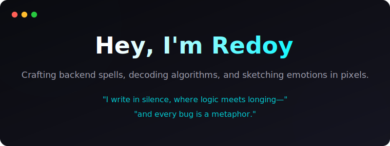

  

  

  

### Tech Arsenal

  

  

### Featured Builds

| Project | Description | Role |
| :--- | :--- | :---: |
| [**floatbar-nvim**](https://github.com/Redooyyy/floatbar-nvim) | A floating terminal inside neovim that remembers buffers seamlessly | `Lua` `Neovim` |
| [**flutter-deps**](https://github.com/Redooyyy/flutter-deps) | A Neovim plugin for adding pub dependencies in your flutter project | `Lua` `Flutter` |
| [**waybar**](https://github.com/Redooyyy/waybar) | A custom, aesthetic statusbar configured for my personal Linux setup | `CSS` `JSON` |

  

### GitHub Metrics

  

 

  
  

  

### Connect with Me

  
  
  

 

  

