  

 

  

 

  

 

<!--  WHO AM I  -->

  

 

  

 

<!--  STACK  -->

<h3 align="center">Stack</h3>

 

&nbsp;&nbsp;
&nbsp;&nbsp;
&nbsp;&nbsp;
&nbsp;&nbsp;

 
 

  

 

  

 

<!--  FEATURED BUILDS  -->

<h3 align="center">Featured Builds</h3>

 

  

[flutter-deps.nvim](https://github.com/Redooyyy/flutter-deps.nvim) &nbsp;|&nbsp;
[floatbar-nvim](https://github.com/Redooyyy/floatbar-nvim) &nbsp;|&nbsp;
[F.L.O.R.A](https://github.com/Redooyyy/F.L.O.R.A) &nbsp;|&nbsp;
[Reoo-s-Dev-Env](https://github.com/Redooyyy/Reoo-s-Dev-Env) &nbsp;|&nbsp;
[nvim-reo-sticky](https://github.com/Redooyyy/nvim-reo-sticky) &nbsp;|&nbsp;
[Reoo-s-Dotfiles](https://github.com/Redooyyy/Reoo-s-Dotfiles)

 

  

 

<!--  GITHUB METRICS  -->

<h3 align="center">Metrics</h3>

 

  

 

  
  &nbsp;
  

 

  

 

  

 

<!--  MIND  -->

 

> *Most people wait for the right moment.*
> *I make the moment right.*

 

> *The terminal is where I think clearly.*
> *The code is where I speak honestly.*

 

  

 

<!--  CONNECT  -->

<h3 align="center">Find Me</h3>

 

  
  &nbsp;
  
  &nbsp;
  
  &nbsp;
  

 

  

 

  

 

  Redoy &nbsp;·&nbsp; still learning &nbsp;·&nbsp; always building

