  

 

  

 

  

 

<!--  WHO AM I  -->

  

 

  

 

<!--  STACK  -->

<h3 align="center">Stack</h3>

 

&nbsp;&nbsp;
&nbsp;&nbsp;
&nbsp;&nbsp;
&nbsp;&nbsp;

 
 

  

 

  

 

<!--  FEATURED BUILDS  -->

<h3 align="center">Featured Builds</h3>

 

<!-- BUILDS START -->

&nbsp;

&nbsp;

&nbsp;

<!-- BUILDS END -->

 

  

 

<!--  GITHUB METRICS  -->

<h3 align="center">Metrics</h3>

 

  

 

  
  &nbsp;
  

 

  

 

  

 

<!--  MIND  -->

 

> *The screen is black, the text is clear,*
> *A quiet focus settles here.*
> *Where errors fall and bugs are caught,*
> *And code is built from silent thought.*
> *No heavy words, no loud display,*
> *Just typing out a better way.*

 

  

 

<!--  CONNECT  -->

<h3 align="center">Find Me</h3>

 

  
  &nbsp;
  
  &nbsp;
  
  &nbsp;
  

 

  

 

  

 

  Redoy &nbsp;·&nbsp; still learning &nbsp;·&nbsp; always building

